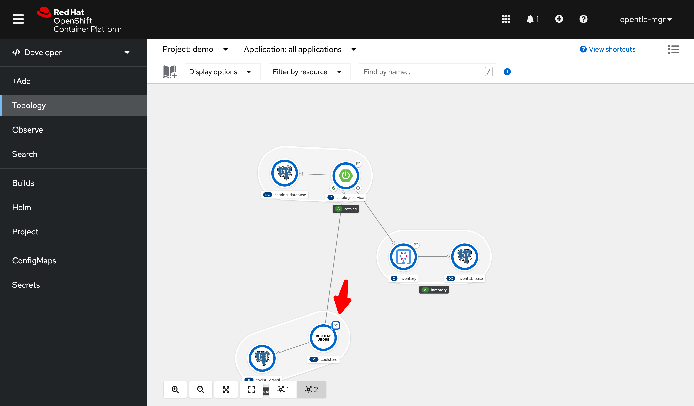
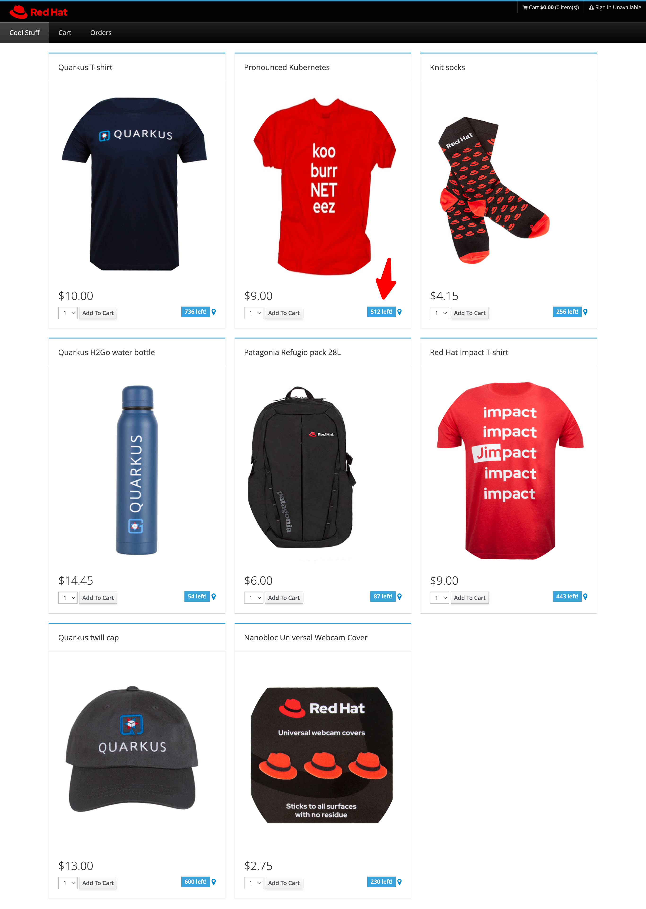
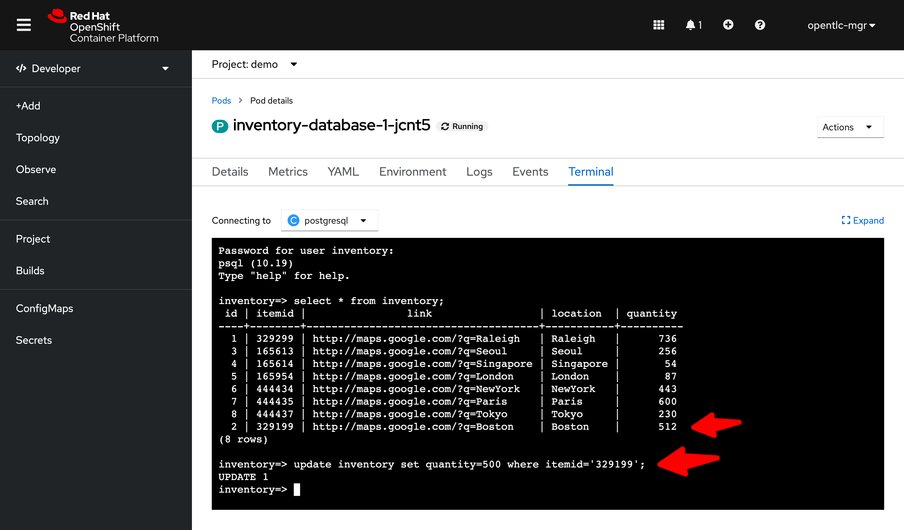
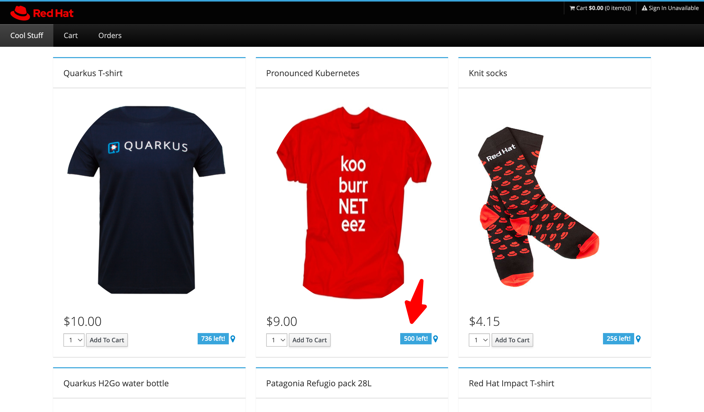
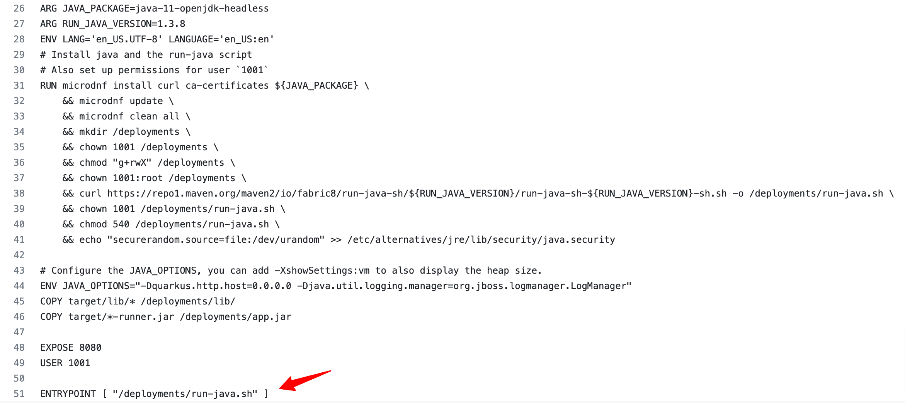
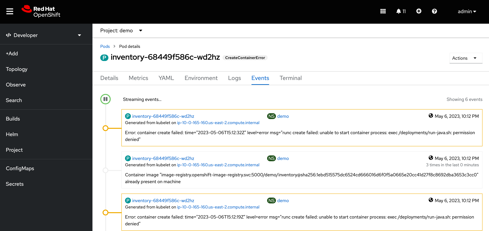

# Demo steps

## Deploy Coolstore applications
1. Create new project name `demo`

2. Deploy a `catalog-service` from Git by using S2I
   - click on `+Add` --> `Import from Git`
   - Add the following value:
     - Git Repo URL: `https://github.com/Fuangwith-Bkk/coolstore`
     - Context dir: `/code/catalog`
     - Builder Image: `Java`
     - Builder Image version: `openjdk-11-ubi8`
     - Application name: `catalog`
     - Name: `catalog-service`
     - Environment Variabels
      - inventory.url = `inventory.demo.svc.cluster.local:8080`
      - JAVA_OPTS_APPEND = `-Dspring.profiles.active=openshift`
    - then click on `Create` button
   
3. Deploy a 'catalog-database' from a Developer Catalog.

   - switch to 'Developer' view
   - click on `+Add` button
   - choose `Developer Catalog` --> `Database`

    

   - click on `PostgeSQL` template.
  
    

   - click on `Instatiate Template`
   - Fill in a template as a following:
     - Database Service Name: `catalog-database`
     - PostgreSQL Connection Username: `catalog`
     - PostgreSQL Connection Password: `mysecretpassword`
     - PostgreSQL Database Name: `catalog`
   - then click on `Create` button

4. Deploy an `inventory` service from a Container Image
   - click on `+Add` --> `Container Image`
   - Add the following value:
     - Image name from external registry: `quay.io/fuangwit/coolstore-inventory:0.2`
     - Runtime icon: `quarkus`
     - Application: `inventory`
     - Name: `inventory`
   - click on `Create` button
  
5. Deploy a `inventory-database` from YAML file
   - click on `+Add` --> `Import YAML`
   - drag an drop `coolstore-inventory-db.yaml` 
   - click on `Create` button

6. run script to deploy
   - execute `./deploy.sh`

## Backup
1. click on `coolstore` service to open the Coolstore Online Shopping website.

    

2. Highlight on red `Pronounced Kubernetes` t-shirt.
   There are 512 quantity in inventory.
    

3. Let's backup 
   > switch to demo backup tool ...

   > backup mountPath: `/var/lib/pgsql/data` of inventory-database

4. update quantity of red `Pronounced Kubernetes` t-shirt.
   - Jump into terminal of `inventory-database-xxx` pod
   - use following command lines:
     - connect to a database a `inventory` database  
      <code>psql -d inventory -U inventory -W</code>
     - enter password: `mysecretpassword`
     - query all items in an inventory  
      <code>select * from inventory;</code>
     - update quantity of itemid `329199` to `500`  
      <code>update inventory set quantity=500 where itemid='329199';</code>   
     

5. refresh the Coolstore Online Shopping page. 
    

6. rollback by the backup tool.
   > switch to demo how to rollback by the backup tool ...

 
---
 

Since OpenShift 4.11, the "restricted-v2" SCC was introduced. The new "restricted-v2" SCC drops "ALL" capabilities from a container (compared to the "restricted" SCC that dropped only a subset), and as a result of this, workloads created in OpenShift 4.11 might fail for a lack of permissions to perform certain operations.
reference [https://connect.redhat.com/en/blog/important-openshift-changes-pod-security-standards](https://connect.redhat.com/en/blog/important-openshift-changes-pod-security-standards) 

For this demo app, we will get "CreateContainerError" for the "inventory" service deployment because the "inventory" service exec "/deployments/run-java.sh"  when start the container. (You could see detail in [Dockerfile.jvm](../code/inventory/src/main/docker/Dockerfile.jvm))

    

If you look at the "Events" tab of the "inventory-xxx" pod, you will see error message like this  

    " Error: container create failed: time="2023-05-06T15:13:42Z" level=error msg="runc create failed: unable to start container process: exec /deployments/run-java.sh: permission denied" 

    

To fix this issue, you could run the following command 

    oc adm policy add-scc-to-user anyuid -z default -n demo

or remove permission by this command

    oc adm policy remove-scc-from-user anyuid -z default -n demo 

 
---
 
To fixing this warning message:

    Warning: would violate PodSecurity "restricted:v1.24"

you could follow this article [Fixing PodSecurity Admission warnings for deployments](Fixing PodSecurity Admission warnings for deployments)
