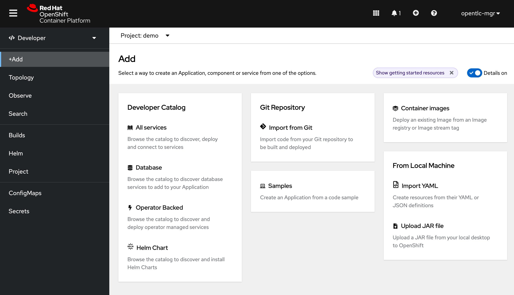
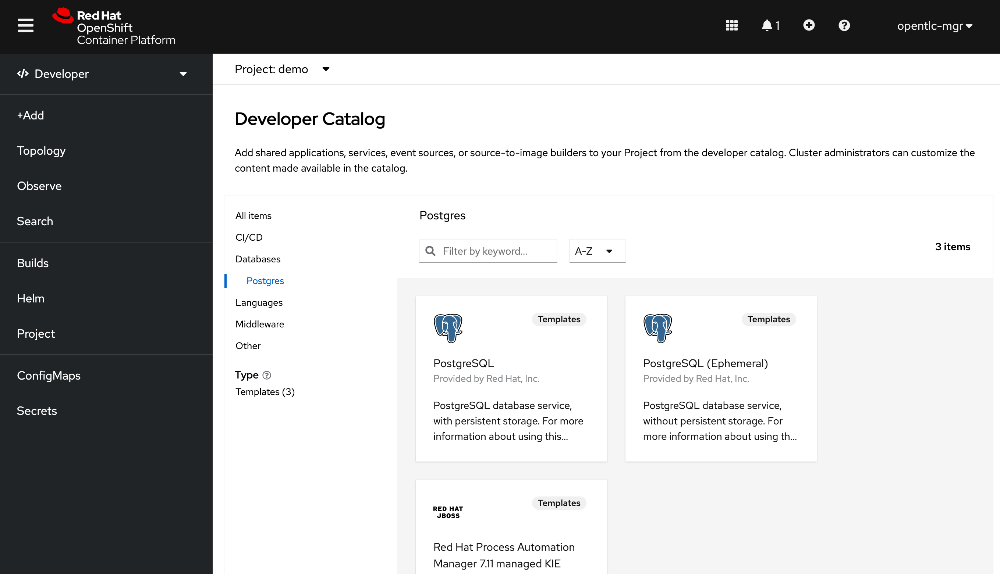

# Demo steps

1. Create new project name `demo`
   
S2I (Source - to - Image)

2. Deploy a 'catalog-database' from a Developer Catalog.

- switch to 'Developer' view
- click on `+Add` button
- choose `Developer Catalog` --> `Database`
  
  

- click on `PostgeSQL` template.
  
  

- click on `Instatiate Template`
- Fill in a template as a following:
  - Database Service Name: `catalog-database`
  - PostgreSQL Connection Username: `catalog`
  - PostgreSQL Connection Password: `mysecretpassword`
  - PostgreSQL Database Name: `catalog`
- then click on `Create` button
  
3. Deploy a `catalog-service` from Git by using S2I
- click on `+Add` --> `Import from Git`
- Add the following value:
  - Git Repo URL: `https://github.com/Fuangwith-Bkk/coolstore`
  - Context dir: `/code/catalog`
  - Builder Image: `Java`
  - Builder Image version: `openjdk-11-ubi8`
  - Application name: `catalog`
  - Name: `catalog-service`
  - Environment Variabels
    - inventory.url = `inventory.demo.svc.cluster.local:8080`
    - JAVA_OPTS_APPEND = `-Dspring.profiles.active=openshift`
  - then click on `Create` button

1. Deploy an `inventory` service from a Container Image
  - click on `+Add` --> `Container Image`
  - Add the following value:
    - Image name from external registry: `quay.io/fuangwit/coolstore-inventory:0.2`
    - Runtime icon: `quarkus`
    - Application: `inventory`
    - Name: `inventory`
  - click on `Create` button
  
5. Deploy a `inventory-database` from YAML file
- click on `+Add` --> `Import YAML`
- drag an drop `coolstore-inventory-db.yaml` 
- click on `Create` button

6. run script to deploy
- execute `./deploy.sh`

