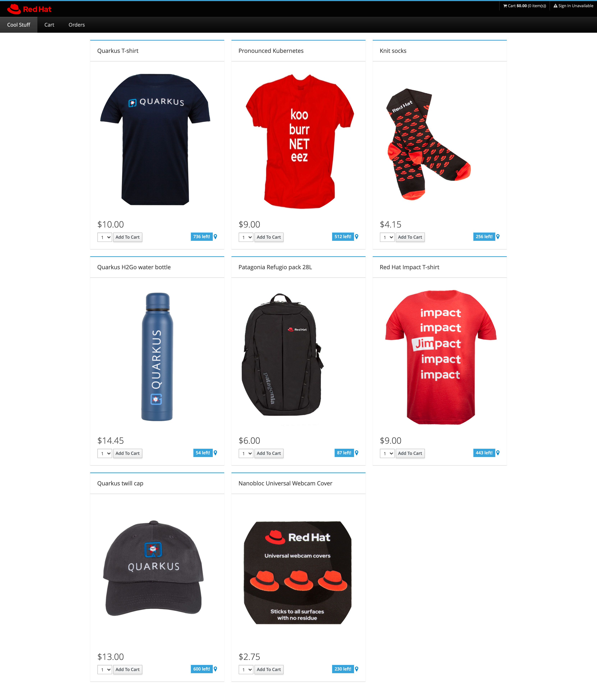
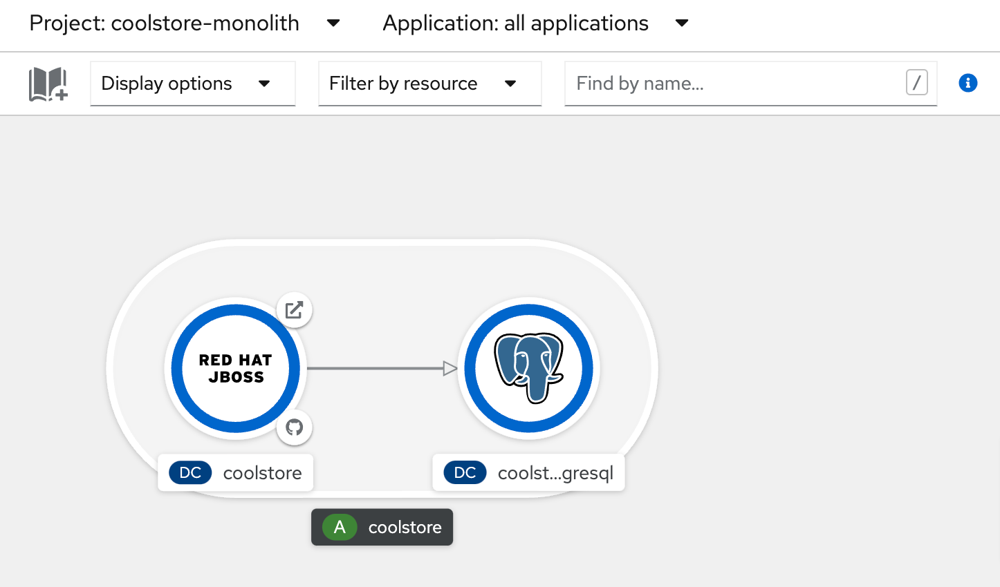
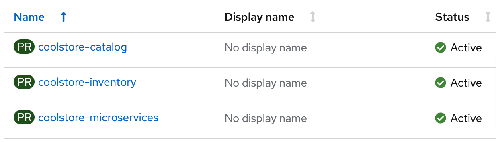
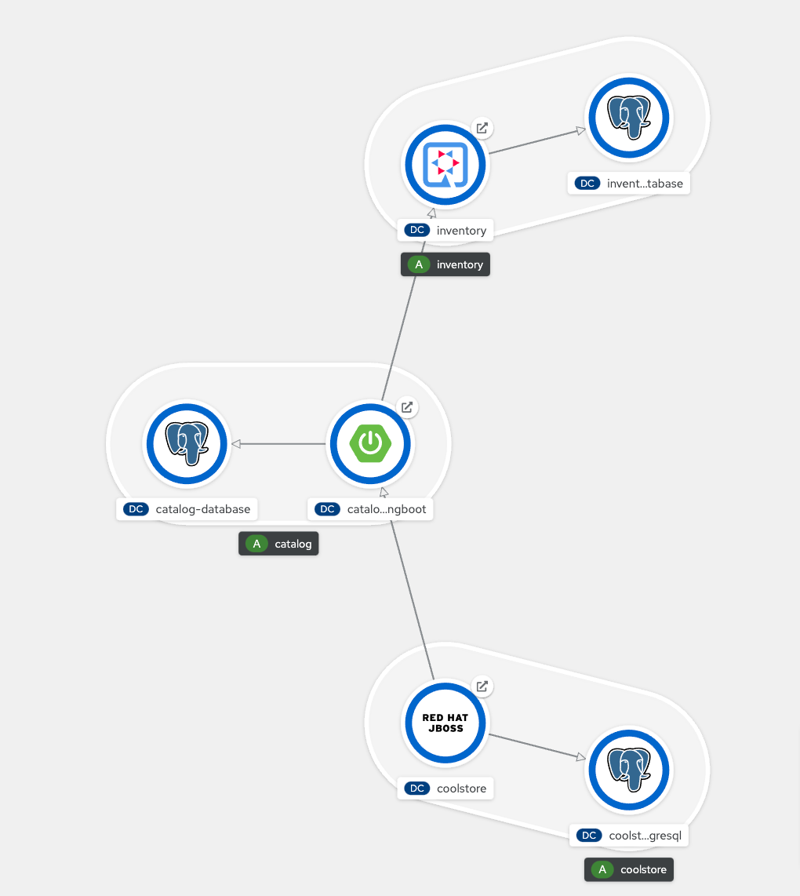

# coolstore

## Monolith 
1.coolstore-monolith is 1 app and 1 database for whole coolstore shop.

[Steps to deploy](1.coolstore-monolith/README.md)

## Microservices
Split monolith coolstore app to 
- Inventory app developed by Quarkus (2.coolstore-inventory)
- Catalog app developed by Spring-Boot (3.coolstore-catalog)
- UI (4.coolstore-microservices)

## Microservices All-in-one
Deploy microservices app in single project. (5.coolstore-all-in-one)
